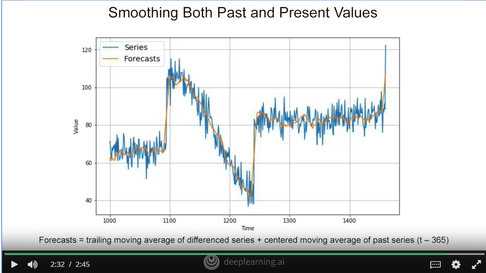

## Screenshots from the lectures 

  
  
  
  
  
  
  
  
  
  
  
  
  
**You generally don't want one year and a half, or else some months will be represented more than others. While this might appear a little different from the training validation test, that you might be familiar with from non-time series data sets. Where you just picked random values out of the corpus to make all three, you should see that the impact is effectively the same. Next you'll train your model on the training period, and you'll evaluate it on the validation period. Here's where you can experiment to find the right architecture for training. And work on it and your hyper parameters, until you get the desired performance, measured using the validation set. Often, once you've done that, you can retrain using both the training and validation data. And then test on the test period to see if your model will perform just as well. And if it does, then you could take the unusual step of retraining again, using also the test data. But why would you do that? Well, it's because the test data is the closest data you have to the current point in time. And as such it's often the strongest signal in determining future values. If your model is not trained using that data, too, then it may not be optimal. Due to this, it's actually quite common to forgo a test set all together. And just train, using a training period and a validation period, and the test set is in the future.**  
  
**Fixed partitioning like this is very simple and very intuitive, but there's also another way. We start with a short training period, and we gradually increase it, say by one day at a time, or by one week at a time. At each iteration, we train the model on a training period. And we use it to forecast the following day, or the following week, in the validation period. And this is called roll-forward partitioning. You could see it as doing fixed partitioning a number of times, and then continually refining the model as such. For the purposes of learning time series prediction in this course, will learn the overall code for doing series prediction.**  
  
  
  
  
  
  

## Quiz  

  
  
  
  
  
  
  
  
  
