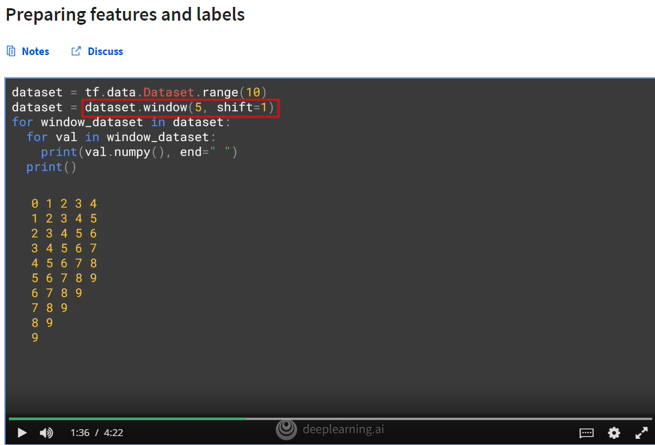
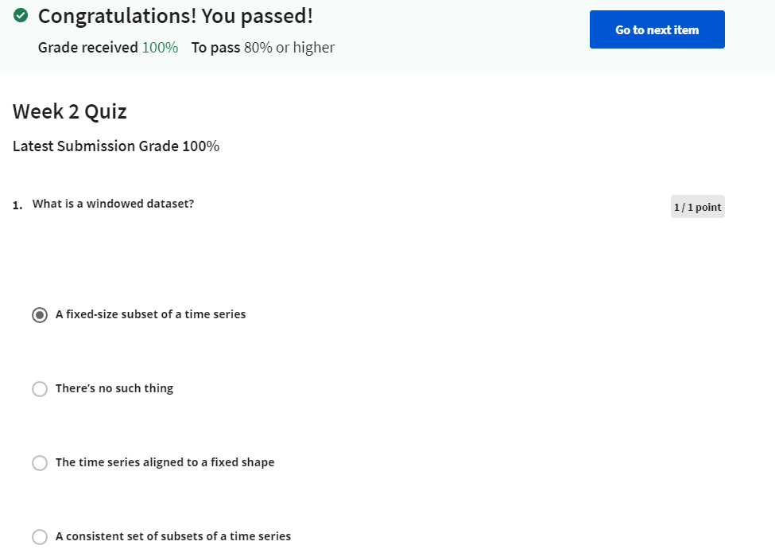
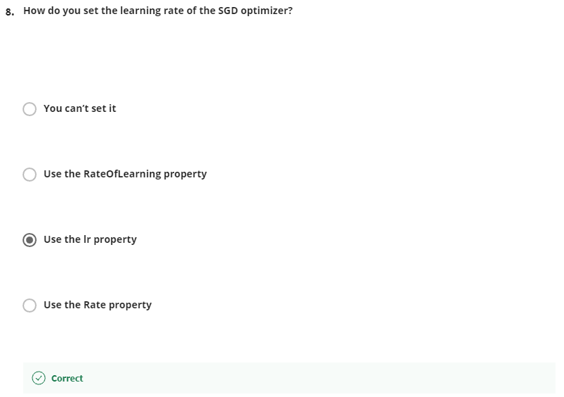

## Screenshots from the lectures 

  
  
  
  
  
  
  
  
**Once it's flattened, it's easy to shuffle it. You call a shuffle and you pass it the shuffle buffer. Using a shuffle buffer speeds things up a bit. So for example, if you have 100,000 items in your dataset, but you set the buffer to a thousand. It will just fill the buffer with the first thousand elements, pick one of them at random. And then it will replace that with the 1,000 and first element before randomly picking again, and so on. This way with super large datasets, the random element choosing can choose from a smaller number which effectively speeds things up.**  
  
  
  
**After training with this, we can then plot the last per epoch against the learning rate per epoch by using this code, and we'll see a chart like this. The y-axis shows us the loss for that epoch and the x-axis shows us the learning rate. We can then try to pick the lowest point of the curve where it's still relatively stable like this, and that's right around 7 times 10 to the -6. So let's set that to be our learning rate and then we'll retrain. So here's the same neural network code, and we've updated the learning rate, so we'll also train it for a bit longer. Let's check the results after training for 500 epochs. Here's the codes to plot out the loss that was calculated during the training, and it will give us a chart like this.**  
  
  
  

## Quiz  

  
  
  
  
  
  
  
  
  
  