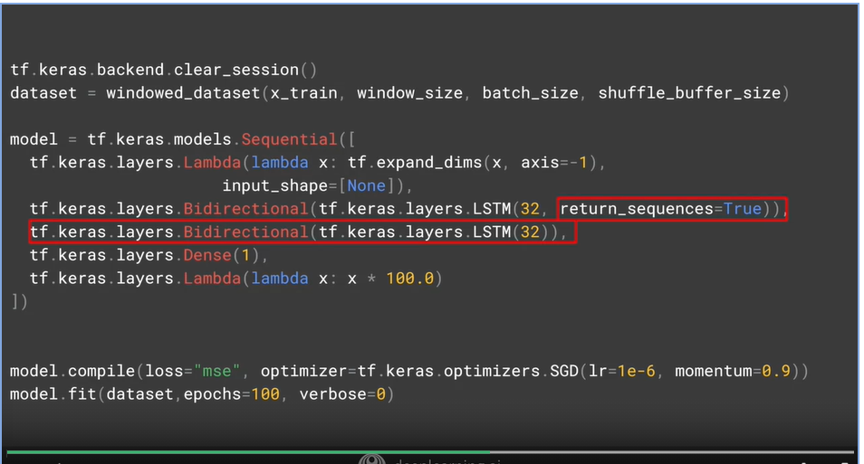

## Screenshots from the lectures 

  
  
  
  
**It's important to take a look at that, and let's dig into that next. The inputs are three dimensional. So for example, if we have a window size of 30 timestamps and we're batching them in sizes of four, the shape will be 4 times 30 times 1, and each timestamp, the memory cell input will be a four by one matrix, like this. The cell will also take the input of the state matrix from the previous step. But of course in this case, in the first step, this will be zero. For subsequent ones, it'll be the output from the memory cell. But other than the state vector, the cell of course will output a Y value, which we can see here. If the memory cell is comprised of three neurons, then the output matrix will be four by three because the batch size coming in was four and the number of neurons is three. So the full output of the layer is three dimensional, in this case, 4 by 30 by 3. With four being the batch size, three being the number of units, and 30 being the number of overall steps. In a simple RNN, the state output H is just a copy of the output matrix Y. So for example, H_0 is a copy of Y_0, H_1 is a copy of Y_1, and so on. So at each timestamp, the memory cell gets both the current input and also the previous output. Now, in some cases, you might want to input a sequence, but you don't want to output on and you just want to get a single vector for each instance in the batch. This is typically called a sequence to vector RNN. But in reality, all you do is ignore all of the outputs, except the last one. When using Keras in TensorFlow, this is the default behavior. So if you want the recurrent layer to output a sequence, you have to specify returns sequences equals true when creating the layer. You'll need to do this when you stack one RNN layer on top of another.**  
  
  
**So consider this RNN, these has two recovered layers, and the first has return_sequences=True set up. It will output a sequence which is fed to the next layer. The next layer does not have return_sequence that's set to True, so it will only output to the final step. But notice the input_shape, it's set to None and 1. TensorFlow assumes that the first dimension is the batch size, and that it can have any size at all, so you don't need to define it. Then the next dimension is the number of timestamps, which we can set to none, which means that the RNN can handle sequences of any length. The last dimension is just one because we're using a unit vary of time series. If we set return_sequences to true and all recurrent layers, then they will all output sequences and the dense layer will get a sequence as its inputs. Keras handles this by using the same dense layer independently at each time stamp. It might look like multiple ones here but it's the same one that's being reused at each time step. This gives us what is called a sequence to sequence RNN. It's fed a batch of sequences and it returns a batch of sequences of the same length. The dimensionality may not always match. It depends on the number of units in the memory sale. So let's now return to a two-layer RNN that has the second one not return sequences. This will give us an output to a single dense.**  
  
  
**But I'd like to add a couple of new layers to this, layers that use the Lambda type. This type of layer is one that allows us to perform arbitrary operations to effectively expand the functionality of TensorFlow's kares, and we can do this within the model definition itself. So the first Lambda layer will be used to help us with our dimensionality. If you recall when we wrote the window dataset helper function, it returned two-dimensional batches of Windows on the data, with the first being the batch size and the second the number of timestamps. But an RNN expects three-dimensions; batch size, the number of timestamps, and the series dimensionality. With the Lambda layer, we can fix this without rewriting our Window dataset helper function. Using the Lambda, we just expand the array by one dimension. By setting input shape to none, we're saying that the model can take sequences of any length. Similarly, if we scale up the outputs by 100, we can help training. The default activation function in the RNN layers is tan H which is the hyperbolic tangent activation. This outputs values between negative one and one. Since the time series values are in that order usually in the 10s like 40s, 50s, 60s, and 70s, then scaling up the outputs to the same ballpark can help us with learning. We can do that in a Lambda layer too, we just simply multiply that by a 100. So let's now take a look at what it takes to build out the full RNN so we can start doing some predictions with it. You'll see that in the next video.**  
  
**In the previous video, you got a look at RNNs and how they can be used for sequence to vector to sequence to sequence prediction. Let's now take a look at coding them for the problem at hand and seeing if we can get good predictions in our time series using them. One thing you'll see in the rest of the lessons going forward is that I'd like to write a little bit of code to optimize the neural network for the learning rate of the optimizer. Can be pretty quick to train and we can from there save a lot of time in our hyper-parameter tuning. So here's the code for training the RNN with two layers each with 40 cells. To tune the learning rate, we'll set up a callback, which you can see here. Every epoch this just changes the learning rate a little so that it steps all the way from 1 times 10 to the minus 8 to 1 times 10 to the minus 6. You can see that setup here while training. I've also introduced a new loss function to use called Huber which you can see here. The Huber function is a loss function that's less sensitive to outliers and as this data can get a little bit noisy, it's worth giving it a shot.**  
  
  
  
**So let's now take a look at some code for LSTMs and how they can work with the data that we've been playing with all week. So here's the update to our code to use LSTMs. Let's unpack it and take a look at the interesting parts. First of all is the tf.keras.backend.clear_session, and this clears any internal variables. That makes it easy for us to experiment without models impacting later versions of themselves. After the Lambda layer that expands the dimensions for us I've added a single LSTM layer with 32 cells. I've also made a bidirectional to see the impact of that on a prediction. The output neuron will give us our prediction value. I'm also using a learning rate of one times 10 _ minus six and that might be worth experimenting with too. So here's the results of running this LSTM on the synthetic data that we've been using throughout the course. The plateau under the big spike is still there and are MAE is in the low sixes. It's not bad, it's not great, but it's not bad. The predictions look like there might be a little bit on the low side too. So let's edit our code to add another LSTM to see the impact. Now you can see the second layer and note that we had to set return sequences equal to true on the first one in order for this to work. We train on this and now we will see the following results. Here's the chart. Now it's tracking much better and closer to the original data. Maybe not keeping up with the sharp increase but at least it's tracking close. It also gives us a mean average error that's a lot better and it's showing that we're heading in the right direction. If we edit our source to add a third LSTM layer like this, by adding the layer and having the second layer return sequences is true we can then train and run it, and we'll get the following output. There's really not that much of a difference and are MAE has actually gone down. So that's it for looking at LSTMs and predicting our sequences. In the next video you'll take a look at using convolutions to see what the impact will be on using them for predicting time-series content.**  
  
  
  
  
  

## Quiz  

  
  
  
  
  
